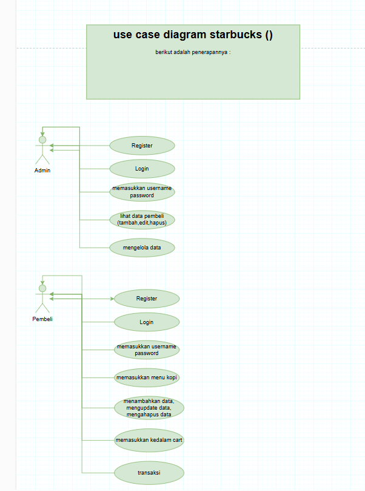

# COPYRIGHT BY 🐣🐣

Nama : Israruddin ...
Kelas : XII PPLG .. 
Task : UJI KOMPETENSI PPLG ...

# CASE PROJECT : sistem manajemenen Starbucks (Kopi RESTO) ☕☕

Deskripsi: Sistem ini memungkinkan pelanggan untuk memilih menu secara langsung by website. untuk memudahkan Pembeli. Sistem ini terdiri dari Admin,Menu(kopi),keranjang(cart),transaksi,dan juga pembeli.

# DESKRIPSI CASE 🤳

Dalam project ini terdapat beberapa entitas utama yang berhubungan satu sama lain:

## Hubungan Antar Tabel:
### 1. Customer (Pembeli): Pengguna yang membeli menu starbucks.
### 2. Admin: Pengguna untuk mendata semua kategori menu yang terbeli oleh pembeli.
### 3. Kopi (Menu): Menyediakan beberapa menu.
### 4. Cart (Keranjang): menyediakan untuk menyimpan menu yang dipilih di daftar keranjang
### 5. Transaksi (Pembayaran): Pembayaran yang dilakukan pelanggan setelah memilih menu.

# RELASI ANTAR ENTITAS ✍

## 1. Admin ke Pembeli (Mengelola):
Setiap pelanggan dapat melakukan satu atau lebih pengelolaan.  
Relasi: One-to-Many

## 2. Pembeli ke Kopi (Memilih Menu):
Setiap pembeli dapat memberikan satu atau lebih menu kopi.  
Relasi: One-to-Many

## 3. Kopi ke Cart (Memasukkan Data):
Setiap menu yang dipilih dapat memberikan ke banyak data.  
Relasi: One-to-Many

## 4. Keranjang ke Transaksi (Pembayaran):
Setiap Menu yang dimasukkan kedalam keranjang memiliki satu pembayaran yang terkait.  
Relasi: One-to-One

## Dependecies / Teknologi yang digunakan 💻

1. npm init -y

    Perintah ini digunakan untuk secara otomatis menginisialisasi dan membuat file package.json

    bash
    npm init -y
    

2. express

    Express JS sebagai framework Node.js untuk mengelola request dan response HTTP

    bash
   npm i express
    

3. mysql

    package untuk melakukan koneksi ke database

    bash
    npm i mysql2
    

4. Axios

    penginstalan axios
    bash
    npm i axios
    

 
    

# CLASS DIAGRAM 

 

 

# RELASI TABLE

 

# ERD DIAGRAM

 

# USECASE DIAGRAM

 

